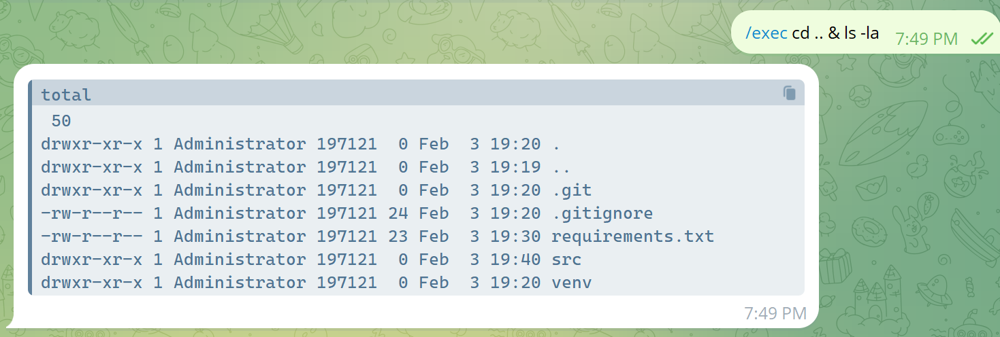

# telegram-ssh-bot

this is a little script to run a telegram bot but it can execute linux cmds.

# Run and install   

* set ur bot token in `tbot/settings.py`
* create virtual environment
* activate virtual environment
* install all requirements in `requirements.txt`
* run `python3 tbot`

# Example

